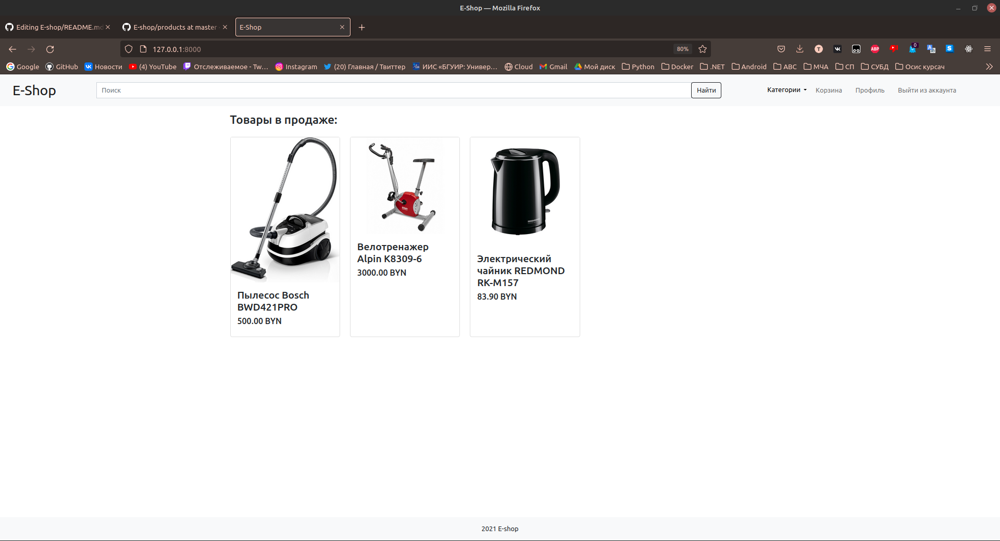
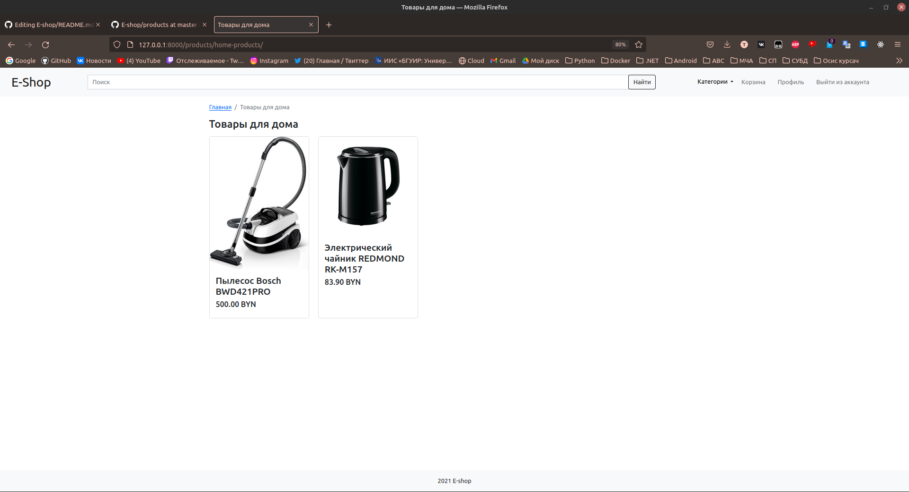
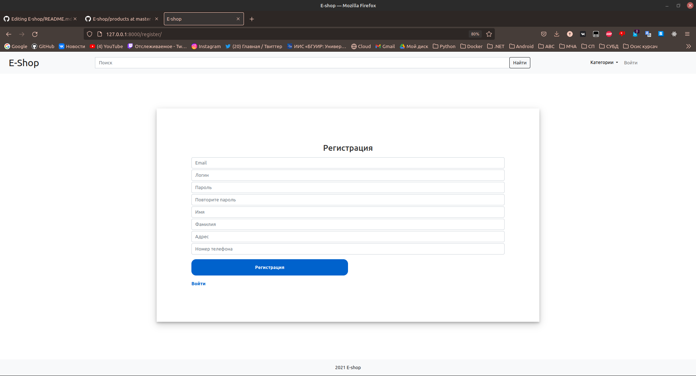
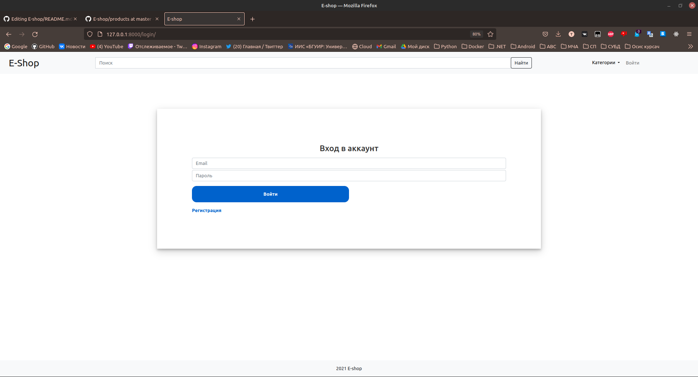
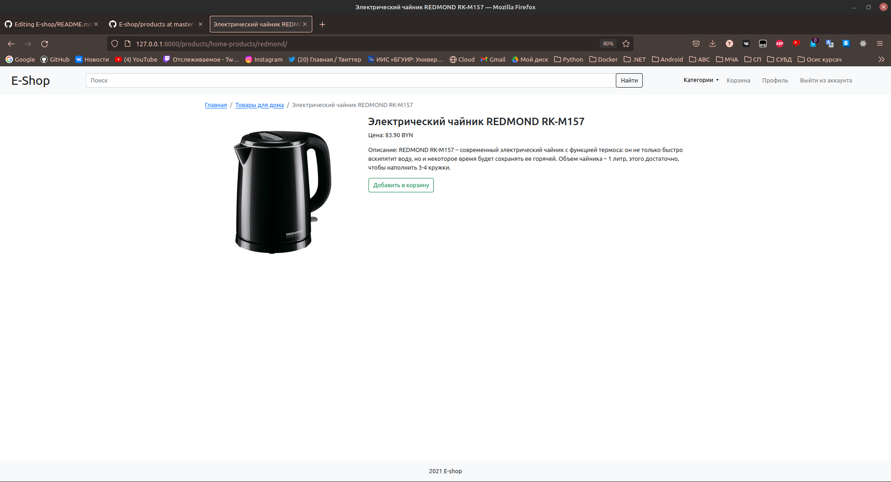
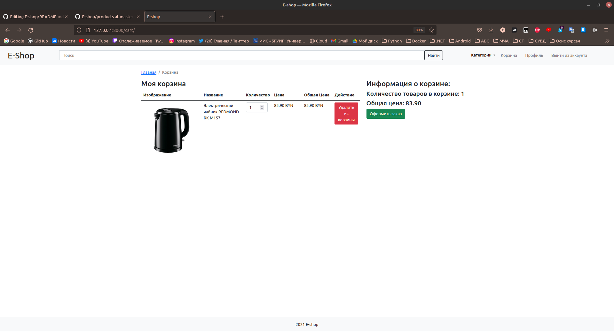
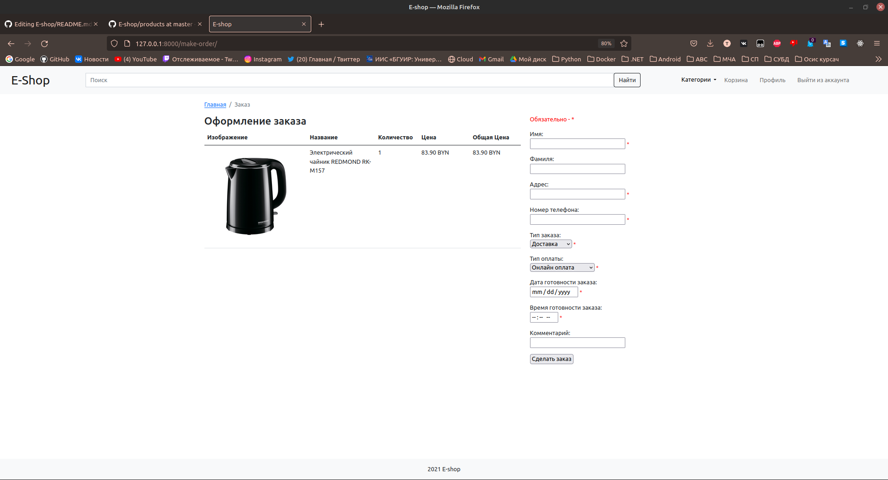
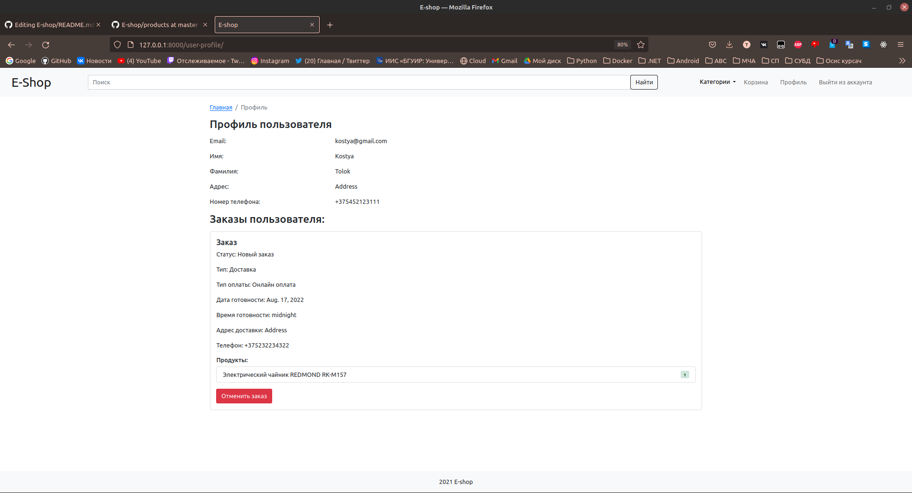

# E-shop

The project is an online store that allows registered users to buy goods sorted into categories

The techologies used during development are Python and Django Framework. MySQL was used as a database.

The project contains docker compose file to launch project and its database in separate containers.

## Main page

When user launches a cite he sees the main page. It shows the list of all available products and navigation menu. 

## Category view

When user clicks on the category name he sees the list of all products in the category.

## Register Page

On register page user can enter his data to create an account.

## Login Page

Login page is used for signing in user's personal account.

## Product view

Product view page displays information about the product, price and a button to add product to user's cart.

## Cart

Cart allows you to view products that you are going to order, change their amount or delete them.

## Order page

Order page requires you to enter all of the personal data required to accomplish the order.

## User profile

User profile shows user's personal data and orders.

